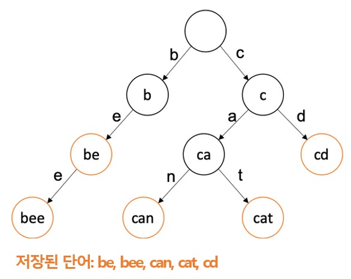

# 트라이(Trie)
Data Structure 다섯 번째 스터디 : 트라이 (Trie)

## 트라이(Trie)란?
* **문자열 집합을 효율적으로 저장하고 탐색**하기 위해 특화된 트리 자료구조
* Digital Tree, Radix Tree, Prefix Tree 라고도 부름 → 트라이는 re**trie**val tree에서 나온 단어
* **문자열 자동 완성 기능**과 같이 문자열을 저장하고 탐색하는데 유용하게 사용 됨

## 트라이(Trie)의 구조

* 루트 노드는 특정 문자를 의미하지 않고 자식 노드만 가지고 있다 (= **루트 노드는 빈 문자**와 연관)
* 이 때, **자식 노드를 Map<Key, Value> 형태**로 가지고 있다
* 루트 노드를 제외한 노드의 자손들은 해당 노드와 **공통 접두어**를 가지고 있다
* **정렬된 트리**구조이다

## 트라이(Trie)의 특징
* [장점] 문자열을 하나씩 전부 비교하는 것보다, 시간 복잡도 측면에서 **검색이 더욱 효율적이고 빠르다**
	* 트라이 탐색 시간 복잡도: O(L)
	* L은 문자열의 길이
* [단점] 각 노드에서 자식들에 대한 포인터들을 배열로 모두 저장 → **저장 공간의 크기가 크다**
	* 트리 생성(저장) 시간 복잡도: O(M×L)
	* M은 문자열의 개수, L은 각 문자열의 길이

## 참고문헌
* https://www.crocus.co.kr/1053
* https://twpower.github.io/187-trie-concept-and-basic-problem
* https://github.com/WooVictory/Ready-For-Tech-Interview/blob/master/Data%20Structure/Trie(%ED%8A%B8%EB%9D%BC%EC%9D%B4).md
* https://velog.io/@kimdukbae/%EC%9E%90%EB%A3%8C%EA%B5%AC%EC%A1%B0-%ED%8A%B8%EB%9D%BC%EC%9D%B4-Trie
